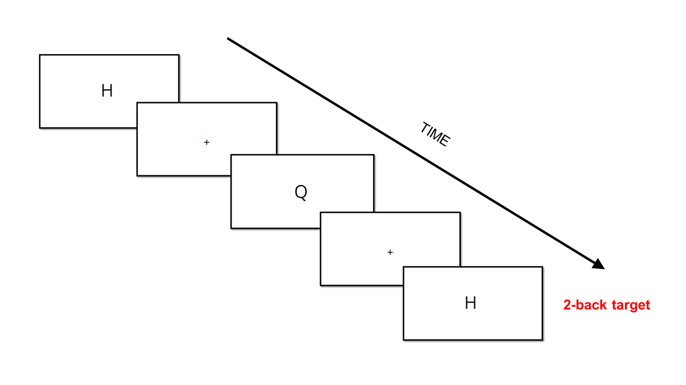

# Verbal N-back task created with jsPsych

<i>Created by the MEMO Team of Lyon Neuroscience Research Center (CRNL) (PI: Dezso Nemeth)</i>
 

A verbal n-back task (<a href="https://psycnet.apa.org/doiLanding?doi=10.1037/h0043688">Kirchner, W. K., 1954</a>) created with the jsPsych library (<a href="https://link.springer.com/article/10.3758/s13428-014-0458-y">de Leeuw, J. R., 2015</a>).

<h2>Citation</h2>
If you use the script, please include this citation in your manuscript:

Vékony, T. (2021). Verbal N-back task created with jsPsych (Version 1.0.0) [Computer software]. https://doi.org/10.5281/zenodo.7100178

<h2>Structure of the task</h2>

In the task, letters are presented on the screen consecutively. The users' task is to press the "J" key on the keyboard for the target elements, and the "F" for the non-target elements. The target stimulus differs between the different level of the task. The task begins with written instructions. Before the two blocks, a 10-trial practice is implemented. During the practice, the users receive feedback about their answer ("Correct", "Wrong", "You did not respond"). After the practice, the two 50-trial long blocks begin. Between blocks, a self-paced rest period is inserted. After the end of the second block, the users receive feedback about there overall success rate and reaction time.

<h2>The levels of the task</h2>
Depending on the value of the <i>level</i> variable (can be modified in <i>parameters.js</i>), 0-back, 1-back, 2-back and 3-back will be performed.
<ul>
 <li><strong>0-back:</strong> The target element is the letter "X".</li>
 <li><strong>1-back:</strong> The target is any letters which were preceeded by the same letter (n is target if n=n-1, where <i>n</i> is the current stimulus on the screen).</li> 
 <li><strong>2-back:</strong> The target is any letters which were preceeded by the same letter 2 trials earlier (n is target if n=n-2, where <i>n</i> is the current stimulus on the screen).</li>
 <li><strong>3-back:</strong> The target is any letters which were preceeded by the same letter 3 trials earlier (n is target if n=n-3, where <i>n</i> is the current stimulus on the screen).</li>
</ul>

<h2>Stimulus presentation parameters</h2>

Ten, phonologically distint letters are used as stimuli (B, K, Q, T, H, M, N, P, X, R). The letters are presented in a fixed pseudo-random order. Each letter is presented for 500 ms with an interstimulus interval of 1500 ms. Stimuli are presented in two 50-trial blocks (100 trials altogether at each level). In the 0-back version, the target X is presented 20 times. Therefore, the target-ratio is set to 20% at each level (20 target trials vs. 80 non-target trials).In the 1-back, 2-back, and 3-back versions, each letter is presented 10 times, and all of them serves as target 2 times (once in each block). After then end of the task, an output file is saved to the local machine in .csv format.

<i>Example for stimulus presentation in the 2-back task.</i>

<h2>Output file</h2>
<ul>
 <li><strong>success:</strong> whether fullscreen mode was successfully started/ended (true or false)</li>
 <li><strong>trial_type:</strong> jsPsych trialtype of the given trial (fullscreen, instructions or html-keyboard-response)</li>
 <li><strong>trial_index:</strong> the number of the given trial (all events considered, even instructions, feedbacks!)</li>
 <li><strong>time_elapsed:</strong> the time elapsed from the start of the program in ms</li>
 <li><strong>internal_code_id:</strong> internal node id of the trial</li>
 <li><strong>subject:</strong> A 15-character long random subject ID for the online version, and customized subject number for the offline version</li>
 <li><strong>session:</strong> customized session number (for offline version only)</li>
 <li><strong>browser_events:</strong> browser events during the task (fullscreenenter, fullscreenexit, blur or focus)</li>
 <li><strong>view_history:</strong> viewing history during the instruction trials</li>
 <li><strong>rt:</strong> the reaction times in ms</li>
 <li><strong>stimulus:</strong> stimulus on the screen in HTML</li>
 <li><strong>key_press:</strong> the JS code of the key pressed</li>
 <li><strong>test_part:</strong> the test part (fixation, test, feedback, debrief)</li>
 <li><strong>correct_response:</strong> the key that should have been pressed ("j" or "f")</li>
 <li><strong>block:</strong> the number of the block (0: practice, 1: first block, 2: second block)</li>
 <li><strong>trial_number:</strong> the number of the trial within the block (1-10 in practice, 1-50 in the two blocks) </li>
 <li><strong>target:</strong> whether the stimulus was a hit target (depends on the level of the task)</li>
 <li><strong>letter:</strong> the letter presented</li>
 <li><strong>correct_rejection:</strong> 1 if stimulus was a non-target and it was correctly recognized as a non-target, 0 otherwise</li>
 <li><strong>miss:</strong> 1 if stimulus was a target and it was incorretly recognized as a non-target, 0 otherwise</li>
 <li><strong>hit:</strong> 1 if stimulus was a target and it was correctly recognized as a target, 0 otherwise</li>
 <li><strong>false_alarm:</strong> 1 if stimulus was a non-target and it was incorrectly recognized as a target, 0 otherwise</li>
</ul>

In the columns start with STAT, basic descriptive statistics are calculated. All of the reported statistics exclude the practice trials.

<ul>
 <li><strong>STAT_nr_hit:</strong> the number of hits</li>
 <li><strong>STAT_nr_miss:</strong> the number of misses</li>
 <li><strong>STAT_nr_false_alarm:</strong> the number of false alarms</li>
 <li><strong>STAT_nr_correct_rejection</strong> the number of correct rejections</li>
 <li><strong>STAT_nr_response:</strong> the number of trials when the user gave and answer</li>
 <li><strong>STAT_nr_no_response:</strong> the number of trials when the user did not give an answer</li>
 <li><strong>STAT_accuracy:</strong> the overall accuracy in the task in percentage (number of correct trials/number of trials with responses)</li>
 <li><strong>STAT_rt_mean:</strong> the overall mean reaction time in the task in ms</li>
 <li><strong>STAT_rt_median:</strong> the overall median reaction time in the task in ms</li>
 <li><strong>STAT_hit_mean:</strong> the mean reaction time for hit trials in ms</li>
 <li><strong>STAT_hit_median:</strong> the median reaction time for hit trials in ms</li>
 <li><strong>STAT_false_alarm_mean:</strong> the mean reaction time for false alarm trials trials in ms</li>
 <li><strong>STAT_false_alarm_median:</strong> the median reaction time for false alarm trials in ms</li>
 <li><strong>STAT_correct_rejection_mean:</strong> the mean reaction time for correct rejection trials trials in ms</li>
 <li><strong>STAT_correct_rejection_median:</strong> the median reaction time for correct rejection trials in ms</li>
 <li><strong>STAT_miss_mean:</strong> the mean reaction time for miss trials trials in ms</li>
 <li><strong>STAT_miss_median:</strong> the median reaction time for miss trials in ms</li>
 <li><strong>STAT_dprime:</strong> d-prime calculated as the different between the normalized hit rate and false alarm rate</li>
</ul>

<h2>Setting options</h2>

You can set the following parameters by modifying the <i>parameters.js</i> file:

<ul>
 <li>level of the n-back: the level of the n-back task as described above (0, 1, 2, or 3 for the four levels)</li>
 <li>trial duration: the presentation time of the fixation cross</li>
 <li>stimulus duration: the presentation time of the letters</li>
 <li>feedback duration: the presentation time of feedback during practice</li>
 <li>language: the language of the program; available languages: english (en), hungarian (hu)</li>
</ul>

<h2>How to start the task</h2>
Open the <i>index.html</i> file in either the <i>offline</i> or <i>online</i> folder. When the offline version is started, you can customize the subject and session numbers (any number is accepted). If you start the offline version, a random subject ID will be allocated.

<h2>Browser requirements</h2>

Any browser except Safari and Internet Explorer. Recommended: Chrome

